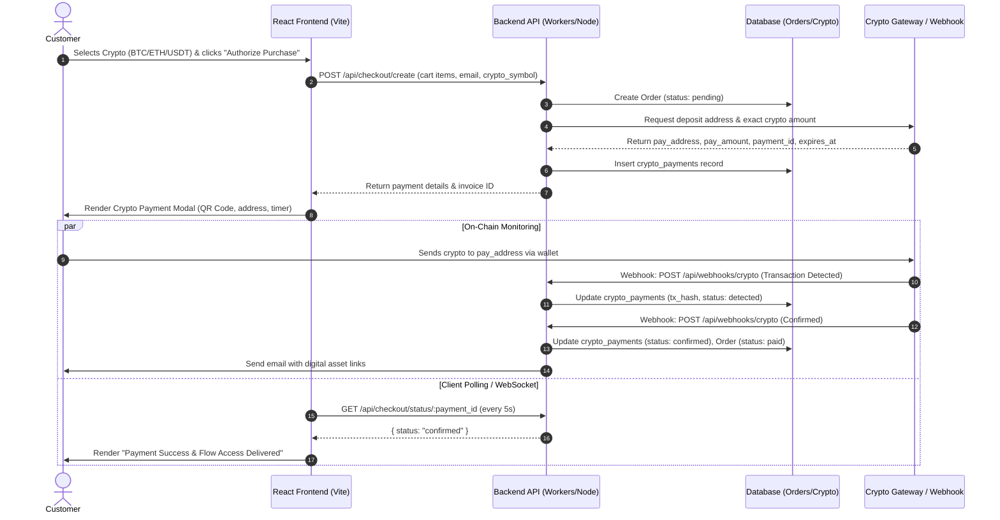

# Crypto Payment Integration Readiness Report

> **Archived historical assessment (August 18, 2026).** The payment backend, D1 persistence, NOWPayments integration, signed webhooks, private checkout status, and R2 fulfillment described here as future work have since been implemented. Use `README.md`, `src/worker.js`, and the current test suites as the authoritative references.

**Project**: GeeLark Flows Marketplace  
**Date**: August 18, 2026  
**Status**: Initial Architecture & Readiness Assessment  

---

## 1. Current Architecture & Tech Stack

### Frontend & Bundling
- **Framework**: React 19 (`react` ^19.1.0, `react-dom` ^19.1.0)
- **Build Tool / Dev Server**: Vite 6 (`vite` ^6.3.5)
- **Deployment Platform**: Cloudflare Workers Static Assets ([wrangler.jsonc](file:///c:/Users/anjan/.gemini/antigravity-ide/scratch/Geelarkflows/wrangler.jsonc))
- **State Management**: React Context (`CartContext` and `FilterContext`)

### Backend & Database
- **Backend Service**: **None currently integrated.** The repository is a pure static Single-Page Application (SPA).
- **Database System**: **None.** Product data is statically served from [src/data/products.js](file:///c:/Users/anjan/.gemini/antigravity-ide/scratch/Geelarkflows/src/data/products.js). Cart items are managed in memory via [`CartContext.jsx`](file:///c:/Users/anjan/.gemini/antigravity-ide/scratch/Geelarkflows/src/context/CartContext.jsx).

### Existing Payment Flows
- **UI Mock**: In [`CartDrawer.jsx`](file:///c:/Users/anjan/.gemini/antigravity-ide/scratch/Geelarkflows/src/components/CartDrawer.jsx), there are payment selection badges for **BTC**, **ETH**, and **USDT**. 
- **Current Logic**: Clicking *"Authorize Purchase"* runs a simulated 2-second `setTimeout` mock (`setCheckingOut` $\rightarrow$ `setCheckoutComplete`).
- **Gateway Integration**: **No active payment gateway** (e.g., Stripe, PayPal, Coinbase Commerce, NOWPayments, or BTCPay Server) is currently integrated.

---

## 2. Database & Data Models

Because no database currently exists, we will need a backend storage layer (e.g., Cloudflare D1 SQLite, Supabase PostgreSQL, or MongoDB) to persist orders and verify crypto transactions.

### Proposed Database Schema

#### A. `orders` Table
| Field | Type | Description |
| :--- | :--- | :--- |
| `id` | `VARCHAR(36)` (UUID) | Unique order identifier |
| `customer_email` | `VARCHAR(255)` | Customer contact email for digital asset delivery |
| `total_usd` | `DECIMAL(10, 2)` | Total USD amount charged |
| `status` | `VARCHAR(32)` | `pending`, `confirming`, `paid`, `expired`, `failed`, `refunded` |
| `items` | `JSON` / `TEXT` | Snapshot of purchased workflow items and quantities |
| `created_at` | `TIMESTAMP` | Order creation timestamp |
| `updated_at` | `TIMESTAMP` | Last status update timestamp |

#### B. `crypto_payments` Table
| Field | Type | Description |
| :--- | :--- | :--- |
| `id` | `VARCHAR(36)` (UUID) | Unique payment transaction ID |
| `order_id` | `VARCHAR(36)` (FK) | Reference to `orders.id` |
| `currency` | `VARCHAR(16)` | Selected crypto (`BTC`, `ETH`, `USDT_TRC20`, `USDT_ERC20`) |
| `pay_address` | `VARCHAR(128)` | Dynamically generated merchant deposit address |
| `pay_amount_crypto` | `DECIMAL(18, 8)` | Exact required cryptocurrency quantity |
| `exchange_rate_usd` | `DECIMAL(14, 4)` | USD-to-Crypto exchange rate snapshot at checkout |
| `tx_hash` | `VARCHAR(128)` | On-chain transaction hash once broadcast |
| `confirmations` | `INTEGER` | Current network block confirmations |
| `required_confirmations` | `INTEGER` | Target confirmations required for fulfillment (e.g. 2 for BTC, 12 for ETH) |
| `expires_at` | `TIMESTAMP` | Expiration time for fixed rate/address lock (e.g. 30 mins) |
| `status` | `VARCHAR(32)` | `waiting`, `detected`, `confirmed`, `underpaid`, `expired` |

---

## 3. Security & Environment Variable Management

### Current Setup
- Environment configuration is stored in [.env](file:///c:/Users/anjan/.gemini/antigravity-ide/scratch/Geelarkflows/.env) and [.env.example](file:///c:/Users/anjan/.gemini/antigravity-ide/scratch/Geelarkflows/.env.example).
- Variables currently exposed to Vite build environment are client-side public variables (`SITE_URL`, `INDEXNOW_KEY`).

### Security Requirements for Crypto Integration
1. **Zero Secret Exposure on Frontend**: Webhook secret keys, merchant API keys, and private RPC keys must **never** be placed in `VITE_` variables or exposed to client-side bundles.
2. **Server-Side Secret Management**:
   - For Cloudflare Workers: Store API keys and webhook signing secrets using `wrangler secret put CRYPTO_GATEWAY_API_KEY` and `wrangler secret put CRYPTO_WEBHOOK_SECRET`.
   - For Node.js / Express backend: Store in server-side `.env` files.
3. **Webhook Cryptographic Verification**:
   - The incoming webhook endpoint (`/api/webhooks/crypto`) MUST verify HMAC signatures (e.g., `X-CC-Webhook-Signature` or `x-nowpayments-sig`) before updating order statuses.
4. **Merchant Address Safety**: Use API-generated single-use deposit addresses or xPub/TPub derivation to prevent address re-use and front-running.

---

## 4. Proposed End-to-End Integration Flow

---

## 5. Potential Blockers & Key Dependencies

1. **Lack of Server Infrastructure**: 
   - *Issue*: The current repository has no active server or API route handler to receive webhooks or issue payment tokens securely.
   - *Solution*: Implement a lightweight API layer (e.g., Cloudflare Workers Functions via `/functions` or an Express/Hono Node backend).
2. **Provider Selection Needed**:
   - *Decision*: We need to select a gateway provider (e.g., **NOWPayments**, **Coinbase Commerce**, or **BTCPay Server** for custodial/non-custodial API generation) vs. building a custom RPC node listener. Managed payment gateways are strongly recommended for seamless multi-chain USDT (TRC-20 / ERC-20), BTC, and ETH handling.
3. **Product Fulfillment Mechanism**:
   - *Requirement*: Define how customers receive their delivered GeeLark flow files after payment confirmation (e.g., secure download link, email delivery, or client dashboard unlock).

---

## Next Steps & Approval Request

To proceed with **Phase 1 (Backend API Layer & Database Setup)**, we will:
1. Initialize the backend API server/functions structure.
2. Setup the lightweight database schema for `orders` and `crypto_payments`.
3. Create the API endpoint `POST /api/checkout/create` and webhook listener `/api/webhooks/crypto`.
4. Integrate the interactive Crypto Payment Modal into [`CartDrawer.jsx`](file:///c:/Users/anjan/.gemini/antigravity-ide/scratch/Geelarkflows/src/components/CartDrawer.jsx).

**Do I have your approval to proceed with Phase 1 of the implementation?**
