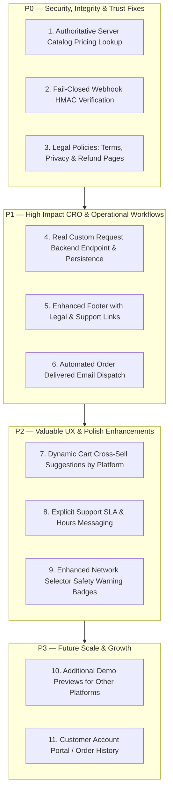

# GeeLark Flows — Production Legitimacy & CRO Improvement Plan

**Document Version**: 1.0.0  
**Date**: August 20, 2026  
**Status**: PROPOSAL — Awaiting Explicit Approval Before Execution  
**Operating Principle**: Minimal, surgical, non-breaking, production-safe enhancements.

---

## Prioritized Implementation Roadmap

---

## Detailed Issue Breakdown

### P0 — Must Fix (Security, Pricing Integrity & Major Trust Blockers)

#### Issue P0-1: Authoritative Server Catalog Pricing Lookup
- **Area**: Backend Checkout API / Pricing Integrity
- **Current Behavior**: `calculateOrderTotals` in [`src/worker.js:463-482`](file:///c:/Users/anjan/.gemini/antigravity-ide/scratch/Geelarkflows/src/worker.js#L463-L482) computes the order subtotal using the `item.price` values submitted directly by the client browser JSON payload.
- **Risk**: A technical user could manipulate client request payloads to purchase high-value workflows (e.g. $1,000 flows) for arbitrary nominal amounts.
- **Recommended Solution**:
  - Store authoritative catalog prices in `src/worker.js` (or D1 `catalog_items` table).
  - During `POST /checkout/create`, look up each `item.id` in the server-side catalog to resolve the exact verified price.
  - Reject checkout creation if unknown item IDs or tampered prices are detected.
- **Files Affected**: [`src/worker.js`](file:///c:/Users/anjan/.gemini/antigravity-ide/scratch/Geelarkflows/src/worker.js).
- **Testing**: Run automated checkout unit tests with modified client prices and confirm server recalculates based strictly on server catalog.

---

#### Issue P0-2: Fail-Closed Webhook HMAC & Svix Signature Verification
- **Area**: Payment & Inbound Webhook Security
- **Current Behavior**:
  - [`src/worker.js:1061`](file:///c:/Users/anjan/.gemini/antigravity-ide/scratch/Geelarkflows/src/worker.js#L1061): `if (secretKey && headerSig)` allows requests without `x-nowpayments-sig` to bypass verification and mark orders as paid.
  - [`src/worker.js:1157`](file:///c:/Users/anjan/.gemini/antigravity-ide/scratch/Geelarkflows/src/worker.js#L1157): `if (webhookSecret)` allows inbound email webhook requests without Svix headers to proceed if secret is unset.
- **Risk**: Potential unauthorized payment status spoofing.
- **Recommended Solution**:
  - Enforce **Fail-Closed** verification:
    - If `!secretKey` or `!headerSig` $\to$ return `401 Unauthorized` immediately.
    - If HMAC verification fails $\to$ return `401 Unauthorized`.
- **Files Affected**: [`src/worker.js`](file:///c:/Users/anjan/.gemini/antigravity-ide/scratch/Geelarkflows/src/worker.js).
- **Testing**: Run test suite verifying that unsigned or incorrectly signed requests are rejected with 401.

---

#### Issue P0-3: Terms of Service, Privacy Policy & Refund Policy Modals/Pages
- **Area**: Customer Trust, Legal Compliance & Commercial Legitimacy
- **Current Behavior**: The website does not contain dedicated Terms of Service, Privacy Policy, or Refund Policy pages or modals.
- **Risk**: High-ticket buyers ($500–$1,400) evaluating B2B automation tools perceive the lack of legal/refund terms as high risk.
- **Recommended Solution**:
  - Implement clean, comprehensive, dedicated modal overlays / routes (`/terms`, `/privacy`, `/refunds`) explaining:
    - Reusable workflow digital license terms.
    - 24-hour delivery commitment and replacement policy for non-functional automation scripts.
    - Privacy commitment (zero storage of customer GeeLark credentials, strict encryption of customer email/metadata).
  - Add clickable links in the footer, Cart summary, and Checkout summary.
- **Files Affected**: [`src/pages/LegalModal.jsx`](file:///c:/Users/anjan/.gemini/antigravity-ide/scratch/Geelarkflows/src/components/LegalModal.jsx), [`src/App.jsx`](file:///c:/Users/anjan/.gemini/antigravity-ide/scratch/Geelarkflows/src/App.jsx), [`src/pages/CartPage.jsx`](file:///c:/Users/anjan/.gemini/antigravity-ide/scratch/Geelarkflows/src/pages/CartPage.jsx), [`src/pages/CheckoutPage.jsx`](file:///c:/Users/anjan/.gemini/antigravity-ide/scratch/Geelarkflows/src/pages/CheckoutPage.jsx).
- **Testing**: Verify modal opens smoothly on all devices and renders clear, professional legal copy.

---

### P1 — High Impact (Conversion Rate, Operations & Lead Capture)

#### Issue P1-1: Real Backend Persistence for Custom Build & Consulting Requests
- **Area**: Lead Capture & High-Value B2B Conversions
- **Current Behavior**: In [`src/components/CustomRequestModal.jsx:45-59`](file:///c:/Users/anjan/.gemini/antigravity-ide/scratch/Geelarkflows/src/components/CustomRequestModal.jsx#L45-L59), form submissions are purely simulated with `setTimeout` and lost.
- **Risk**: Prospective enterprise clients submitting requests for custom automation builds ($2,000–$10,000+) receive fake success confirmations while their leads are never received.
- **Recommended Solution**:
  - Create `POST /api/custom-request` in [`src/worker.js`](file:///c:/Users/anjan/.gemini/antigravity-ide/scratch/Geelarkflows/src/worker.js).
  - Store request in D1 `custom_requests` table and dispatch notification email to `support@geelarkflows.com`.
  - Connect `CustomRequestModal.jsx` to this live endpoint.
- **Files Affected**: [`src/components/CustomRequestModal.jsx`](file:///c:/Users/anjan/.gemini/antigravity-ide/scratch/Geelarkflows/src/components/CustomRequestModal.jsx), [`src/worker.js`](file:///c:/Users/anjan/.gemini/antigravity-ide/scratch/Geelarkflows/src/worker.js), [`schema.sql`](file:///c:/Users/anjan/.gemini/antigravity-ide/scratch/Geelarkflows/schema.sql).
- **Testing**: Submit test lead and verify persistence in D1 and email notification delivery.

---

#### Issue P1-2: Expanded Professional Footer with Navigation & Support
- **Area**: Site Credibility & SEO Navigation
- **Current Behavior**: The footer only has brand lockup, tagline, and a "Talk to us ↗" button.
- **Recommended Solution**:
  - Transform footer into a structured 4-column layout:
    1. *Brand & Overview*: GeeLark Flows lockup, purpose, USDT settlement badge.
    2. *Catalog Navigation*: Quick links to Instagram, TikTok, Snapchat, Reddit, YouTube flows.
    3. *Company & Policies*: Terms of Service, Privacy Policy, Refund Policy, FAQ.
    4. *Support & Contact*: Clickable `support@geelarkflows.com`, 24-hour response assurance.
- **Files Affected**: [`src/App.jsx`](file:///c:/Users/anjan/.gemini/antigravity-ide/scratch/Geelarkflows/src/App.jsx), [`src/App.css`](file:///c:/Users/anjan/.gemini/antigravity-ide/scratch/Geelarkflows/src/App.css).

---

#### Issue P1-3: Automated Fulfillment "Order Delivered" Email Dispatch
- **Area**: Customer Fulfillment Lifecycle
- **Current Behavior**: When an admin marks an order as `package_delivered` or `setup_completed` in the admin panel, no automated email is dispatched to the customer.
- **Recommended Solution**:
  - Update `POST /api/admin/orders/:id/fulfillment-status` in `src/worker.js` to automatically dispatch an "Order Delivered & Setup Instructions" email via Resend when transitioning to `package_delivered` or `setup_completed`.
- **Files Affected**: [`src/worker.js`](file:///c:/Users/anjan/.gemini/antigravity-ide/scratch/Geelarkflows/src/worker.js).

---

### P2 — Valuable Polish & Experience Improvements

#### Issue P2-1: Dynamic Cart Cross-Sell Suggestions by Platform
- **Area**: Cart CRO & Average Order Value (AOV)
- **Current Behavior**: `CartPage.jsx` shows the first 3 catalog items not in cart.
- **Recommended Solution**: Suggest complementary workflows based on the platform of items already in the cart (e.g. if Instagram Account Creation is in cart, recommend Instagram Warmup and Instagram Profile Editing).
- **Files Affected**: [`src/pages/CartPage.jsx`](file:///c:/Users/anjan/.gemini/antigravity-ide/scratch/Geelarkflows/src/pages/CartPage.jsx).

---

#### Issue P2-2: Stated Support SLA & Response Window
- **Area**: Buyer Confidence & Post-Purchase Support
- **Current Behavior**: Support email is listed without explicit hours or response timelines.
- **Recommended Solution**: Add subtle supporting copy: *"Customer Support: Mon–Sat · Typically responds in under 4 hours · support@geelarkflows.com"*.
- **Files Affected**: [`src/pages/CartPage.jsx`](file:///c:/Users/anjan/.gemini/antigravity-ide/scratch/Geelarkflows/src/pages/CartPage.jsx), [`src/pages/CheckoutPage.jsx`](file:///c:/Users/anjan/.gemini/antigravity-ide/scratch/Geelarkflows/src/pages/CheckoutPage.jsx), [`src/App.jsx`](file:///c:/Users/anjan/.gemini/antigravity-ide/scratch/Geelarkflows/src/App.jsx).

---

### P3 — Future Growth & Long-Term Enhancements

#### Issue P3-1: Additional Video Demonstrations
- Add video walkthrough recordings for TikTok, Snapchat, and Reddit automation workflows to match the high-converting Instagram demo.

---

## Recommended Execution Order Upon Approval

1. **Step 1 (P0)**: Enforce authoritative server-side pricing lookup in `src/worker.js`.
2. **Step 2 (P0)**: Strengthen webhook HMAC/Svix signature verification to fail closed.
3. **Step 3 (P0)**: Implement Terms of Service, Privacy Policy, and Refund Policy modals.
4. **Step 4 (P1)**: Connect `CustomRequestModal` to live `POST /api/custom-request` endpoint with D1 storage and email alerts.
5. **Step 5 (P1)**: Upgrade footer to structured 4-column layout with legal/navigation links.
6. **Step 6 (P1)**: Add automated fulfillment dispatch emails for delivered orders.
7. **Step 7 (P2)**: Enhance dynamic cart recommendations and support SLA badges.
